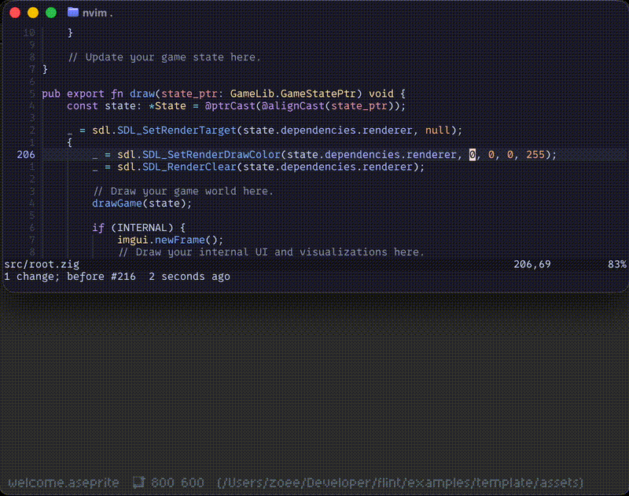
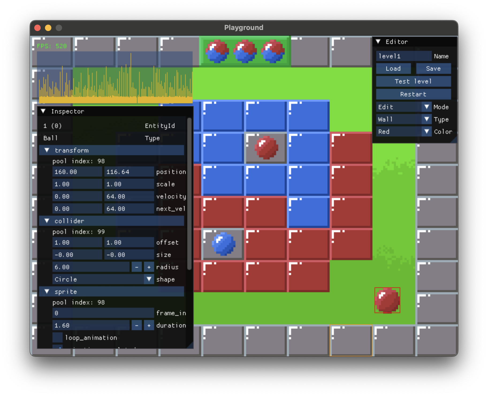
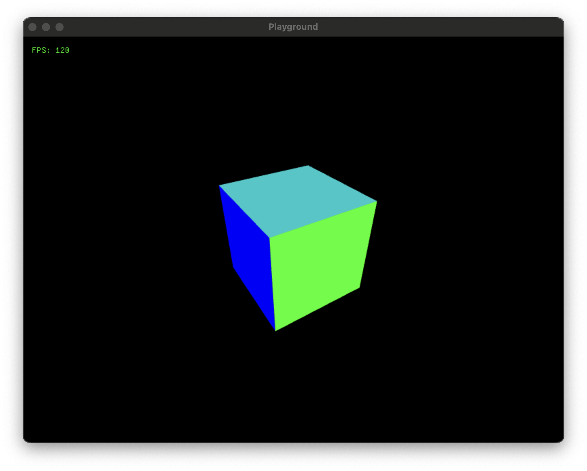

# Flint
*Strike your own engine*

Building blocks for the game engine your game actually needs.


## Quick start
To get your own project up and running quickly you can use the project generator to create a new project based on our template. The current template is currently 2D and uses Aseprite for assets, we will add more templates in the future as they become available.

```
git clone https://github.com/zoeesilcock/flint.git && cd flint

zig build new -- ../my_new_project

cd ../my_new_project && zig build run
```


## Demo
A quick demo of some of the coolest features: comptime generated inspector windows, and code/asset hot reloading:



## Usage
To use this in your own projects you include it as a dependency, integrate it into your `build.zig` file and then implement a library which follows the API expected by the main executable. See the [documentation](https://zoeesilcock.github.io/flint/), and the examples for more details.

### Add dependency
```
zig fetch --save git+https://github.com/zoeesilcock/flint.git#v0.11.0
```

### Exposed modules
* sdl - exposes the SDL C API.
* imgui - exposes the ImGui C API and backend integrations for the SDL3 Renderer and SDL3 GPU APIs.
* internal - exposes tools used to generate editors and tools for internal builds.
* aseprite - exposes the aseprite importer.

### Hot reloading
Both the code and the assets automatically update in-game when modified. For code this is achieved by having the entire game code inside a shared library with a thin executable that takes care of reloading the shared library when it changes. When Flint detects a change in the code it triggers `zig build -Dlib_only`. When it detects a change in the dynamic library it loads the new one, making it fully automated. For assets the executable lets the game know when assets have changed so that it can react to that in whatever way that makes sense, the examples reload the assets which shows changes instantly without interrupting the game.

### Packaging
Building and packaging for release is a broad topic and works differently on each platform. Flint doesn't provide an automated way to do this yet, so it has to be done manually. The executable looks for the game library and assets in a few different places to help make it portable.

#### Asset search paths
Asset paths default to being relative to the current working directory, if not found there it will try relative to the directory of the executable. This allows the assets to be in the root directory of the project during development and in the same directory as the executable for release. Internal builds support hot reloading of assets even when the executable is not in the development environment, so it's possible to share an internal build with an artist to work on the assets. We might consider baking the assets into the library for release builds in the future.

#### Library search paths
In development mode it defaults to looking for the library in zig-out (zig-out/bin on Windows and zig-out/lib otherwise). If it fails to find the game library it will look in the same directory as the executable as well as in `./lib` relative to the executable. This allows using the default output locations while developing and then a couple of options when packaging for release.

For other libraries like SDL, the executable looks in the same directory as the executable and in `./lib` relative to the executable. Windows is an exception here as it has its own [search order](https://learn.microsoft.com/en-us/windows/win32/dlls/dynamic-link-library-search-order) for DLLs. The simplest approach is to place the SDL library in the same directory as the executable.


## Examples

### [Diamonds](examples/diamonds/README.md)
This example is inspired by the classic game [Diamonds](https://en.wikipedia.org/wiki/Diamonds_\(video_game\)). The objective is to clear the screen of colored blocks without hitting spiky blocks. It uses the SDL3 Renderer API to render 2D sprites based on Aseprite files.


### [Cube](examples/cube/README.md)
This example uses the SDL3 GPU API to render a cube.


### [Template](examples/template/README.md)
This example aims to a minimal implementation of a project. If you want to get up and running with your own project quickly this is a good place to start.


## Rationale
Making games is hard and time consuming, and it's usually not possible to know in advance what will be fun. This means that iteration speed and flexibility of experimentation are the most important factors in increasing the chances of finding the fun.

Mainstream game engines are very general and are rarely well suited for any specific type of game. Iteration speed is often quite low which breaks us out of flow every time we make a change. Most tasks include painfully manual and repetitive workflows that require navigating complex UIs with the mouse.

Since each game is unique, the best engine, editor, and workflows for any specific game are also unique. Making a general purpose game engine is a bigger undertaking than making a game, but making the parts of a game engine needed for a specific game is more manageable.

This project aims to identify and implement tools needed to create bespoke game engines. This is not a game engine, but rather a set of tools and ideas that help you build the right engine for your game.

### Guiding principles
* **Programmer-centric**\
    We prefer data in text or code so it can be manipulated with standard text editors and version control tools.
* **Integrated asset pipeline**\
    Asset creation and deployment should be integrated and streamlined to allow for quick iteration and experimentation.
* **Low dependencies**\
    We prefer to own the code that makes our games unique.
    * We chose SDL3 for its wide platform support.
    * We chose Dear ImGui since it's very widely used, but may replace it with something like [DVUI](https://github.com/david-vanderson/dvui) in the future.
* **Open source**\
    We prefer the freedom to use our tools however we like without arbitrary rules, licensing fees, vendor lock-in or rug pulls.


## Development
This project is built using the zig build system, use `zig build -h` for a list of options or look at the `build.zig` file for more details.

### Debugging
Debugger configurations for VS Code are included in the main project as well as the example projects, it will prompt to install the required extension if you don't have it. When using VS Code it is also helpful to open the workspace file located in `.vscode/flint.code-workspace` to get an overview of the full project.

### Documentation
The documentation is generated using the zig autodoc system. It can be generated locally or [viewed online](https://zoeesilcock.github.io/flint/).

To generate and run locally:
```
zig build docs
python -m http.server -b 127.0.0.1 8000 -d zig-out/docs/
```
