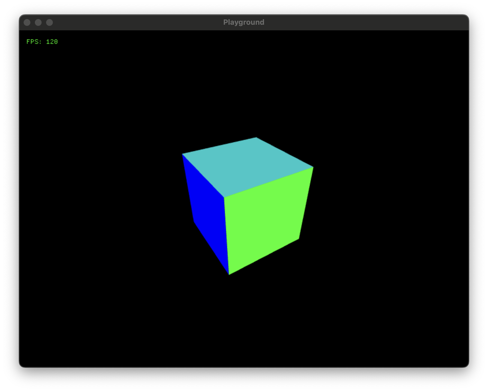

# Gamedev Playground
*Exploring ways to make game development a more pleasurable experience.*

A collection of tools and ideas that help you build the game engine that's right for your game.


## Examples

### [Diamonds](examples/diamonds/README.md)
This example is inspired by the classic game [Diamonds](https://en.wikipedia.org/wiki/Diamonds_\(video_game\)). The objective is to clear the screen of colored blocks without hitting spiky blocks. It uses the SDL3 Renderer API to render 2D sprites based on Aseprite files.


### [Cube](examples/cube/README.md)
This example uses the SDL3 GPU API to render a cube.



## Rationale
Making games is hard and time consuming, and it's usually not possible to know in advance what will be fun. This means that iteration speed and flexibility of experimentation are the most important factors in increasing the chances of finding the fun.

Mainstream game engines are very general and are rarely well suited for any specific type of game. Iteration speed is often quite low which breaks us out of flow every time we make a change. Most tasks include painfully manual and repetitive workflows that require navigating complex UIs with the mouse.

Since each game is unique, the best engine, editor, and workflows for any specific game are also unique. Making a general purpose game engine is a bigger undertaking than making a game, but making the part of a game engine needed for a specific game is more manageable.

This project aims to identify and implement tools needed to create bespoke game engines. This is not a game engine, but rather a set of tools and ideas that help you build the right engine for your game.

### Guiding principles
* **Programmer-centric**\
    We prefer data in text or code so it can be manipulated with standard text editors and version control tools.
* **Integrated asset pipeline**\
    Asset creation and deployment should be integrated and streamlined to allow for quick iteration and experimentation.
* **Low dependencies**\
    We prefer to own the code that makes our games unique.
    * We chose SDL3 for its wide platform support.
    * We chose Dear ImGui since it's very widely used, but may replace it with something like [DVUI](https://github.com/david-vanderson/dvui) in the future.
* **Open source**\
    We prefer the freedom to use our tools however we like without arbitrary rules, licensing fees, vendor lock-in or rug pulls.


## Hot reloading
Both the code and the assets automatically update in-game when modified. For code this is achieved by having the entire game code inside a shared library with a thin executable that takes care of reloading the shared library when it changes. For assets the executable lets the game know when assets have changed so that it can react to that in whatever way that makes sense, in this case it simply reloads the assets without interrupting the game.

Examples are setup to allow for automatically rebuilding the shared library when you change the code by keeping the following command running in a separate terminal:
```
zig build -Dlib_only --watch
```


## Development
The project is built using the zig build system, use `zig build -h` for a list of options or look at the `build.zig` file for more details.

### Debugging
Debugger configurations for VS Code are included in the main project as well as the example projects, it will prompt to install the required extension if you don't have it. When using VS Code it is also helpful to open the workspace file located in `.vscode/gamedev-playground.code-workspace` to get an overview of the full project.

### Documentation
The documentation is generated using the zig autodoc system. It can be generated locally or [viewed online](https://zoeesilcock.github.io/gamedev-playground/).

To generate and run locally:
```
zig build docs
python -m http.server -b 127.0.0.1 8000 -d zig-out/docs/
```


## Usage
To use this in your own projects you include it as a dependency, integrate it into your `build.zig` file and then implement a library which follows the API expected by the main executable. See the [documentation](https://zoeesilcock.github.io/gamedev-playground/), and the examples for more details.

### Add dependency
```
zig fetch --save git+https://github.com/zoeesilcock/gamedev-playground.git
```

### Exposed modules
* sdl - exposes the SDL C API.
* imgui - exposes the ImGui C API and backend integrations for the SDL3 Renderer and SDL3 GPU APIs.
* internal - exposes tools used to generate editors and tools for internal builds.
* aseprite - exposes the aseprite importer.
