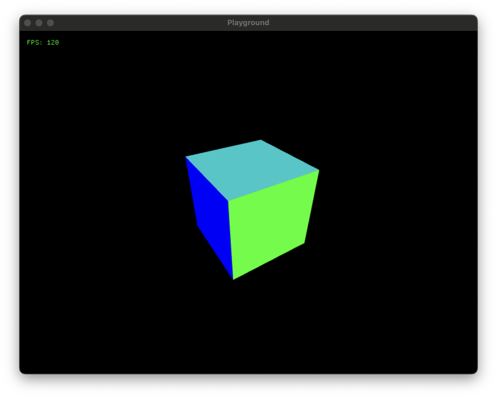

# Cube

This example uses the SDL3 GPU API to render a cube.




## Integrated editor

### Controls
* F1: Cycle between FPS display modes (none, number, or number and graph).


## Hot reloading
To automatically rebuild the shared library when you change the code you can leave the following command running in a separate terminal:
```
zig build -Dlib_only --watch
```
