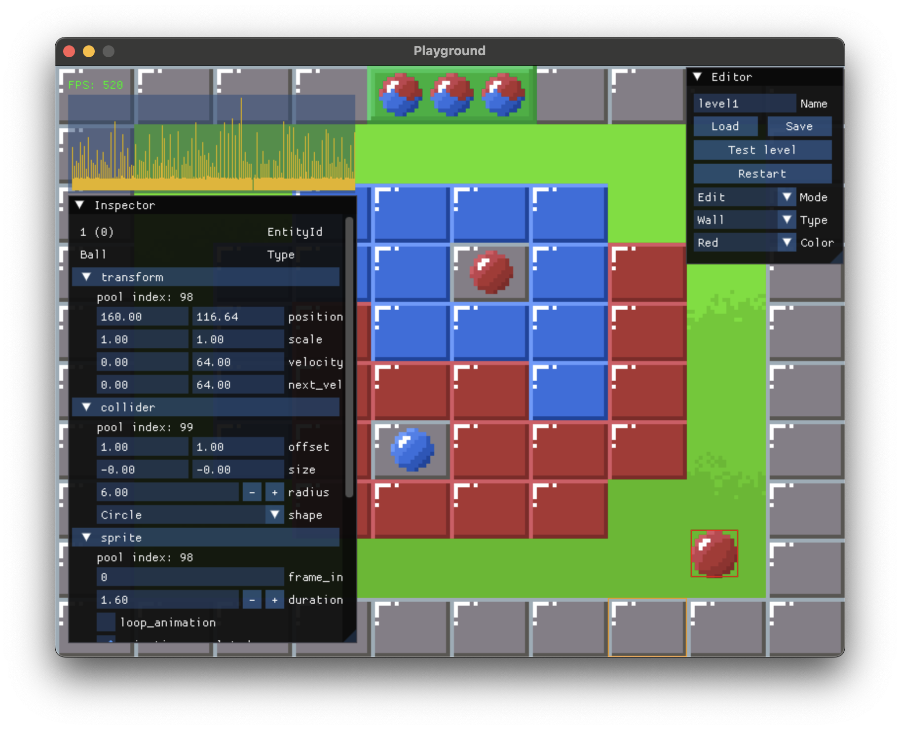

# Diamonds

This example is inspired by the classic game [Diamonds](https://en.wikipedia.org/wiki/Diamonds_\(video_game\)). The objective is to clear the screen of colored blocks without hitting spiky blocks. It uses the SDL3 Renderer API to render 2D sprites based on Aseprite files.



### Controls
* Left arrow: Move the ball to the left.
* Right arrow: Move the ball to the right.
* P: Toggle pause.
* F: Toggle fullscreen.


## Integrated editor
Hovering over entities with the mouse will highlight them.

Clicking on them will bring up the inspector which shows all components and their fields and allows editing them.

Double clicking on an entity will open it's sprite in Aseprite. This works particularly well together with hot reloading since you can double click a sprite, edit it, save it, and instantly see the result in-game.

### Controls
* C: Toggle collider outlines.
* F1: Cycle between FPS display modes (none, number, or number and graph).
* F2: Toggle the memory usage graph.
* G: Toggle game state inspector.
* E: Toggle level editor.
* S: Save level.
* L: Load level.
* Alt/Option + click: Grabs the color and/or type of the clicked element like an eye dropper tool.


## Hot reloading
To automatically rebuild the shared library when you change the code you can leave the following command running in a separate terminal:
```
zig build -Dlib_only --watch
```
